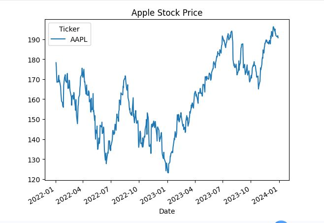

# Stock Price Analysis (Apple - AAPL)

This is a beginner-friendly project analyzing Apple stock prices using Python and Google Colab.

## Project Overview

The goal of this project is to understand and visualize the historical stock price trends of Apple (AAPL) using Python. This project demonstrates basic data analysis and visualization techniques.

## Features

- Download historical stock data (2022-2024) using yfinance
- Visualize closing price trends
- Calculate moving averages (50-day and 200-day)
- Perform basic statistical analysis of stock prices

## Tools & Libraries Used

- Python
- Pandas
- Matplotlib
- yfinance
- Google Colab

## How to Run

1. Open the notebook in Google Colab
2. Run all cells step by step
3. Visualize stock prices and moving averages

## Output Example

- Closing Price Graph
- Moving Average Graph

## Closing Price Graph

## Moving Average Graph

## Author

- [WARDA LATIF]

